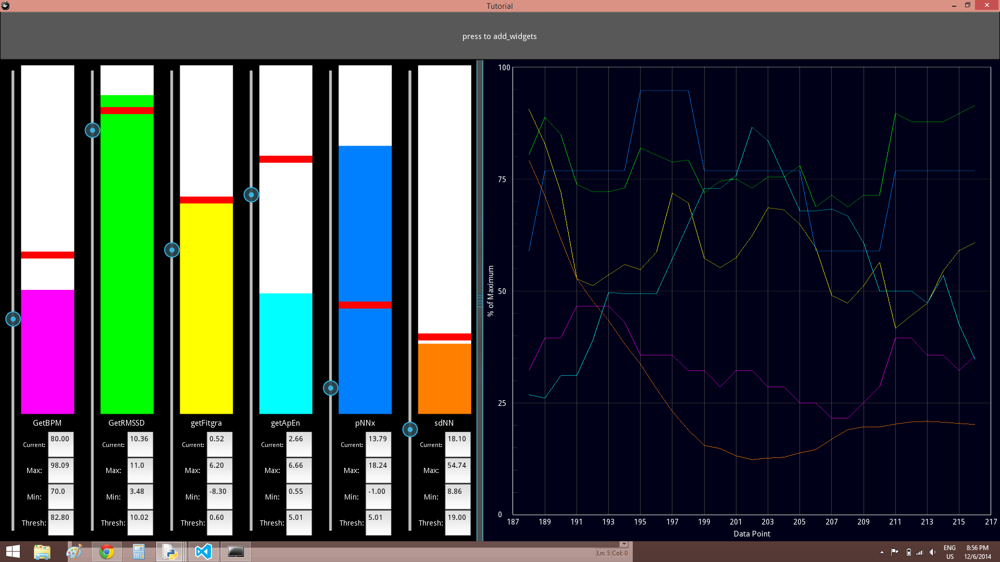

# Biofeedback Suite
This project is a prototype biofeedback suite for the purposes of delivering real-time feedback of various biosensor data using:
- Visual feedback in the form of bar meters and graphs
- Haptic feedback in the form of vibration alerts delivered using vibration motors controlled via Arduino

Here are some screenshots of the Biofeedback Suite in action:

 

## KivyAppMain.py
This file begins with the [Kivy](https://kivy.org/) style string that outlines the structure and appearance of the Kivy app. The rest encodes the functionality of each widget. 

## DemoMetrics.py
The purpose of this file is to read in biosensor data and then analyze it to produce the desired metrics. Biosensor data is read from a txt file which can be produced in a variety of ways depending on your sensors. Our code for doing this is not present as we were forced to use a highly convoluted method due to issues with connecting to our bluetooth heart rate monitor. 

Note: In this old version only a subset of the metrics seen in the screenshots are available.
